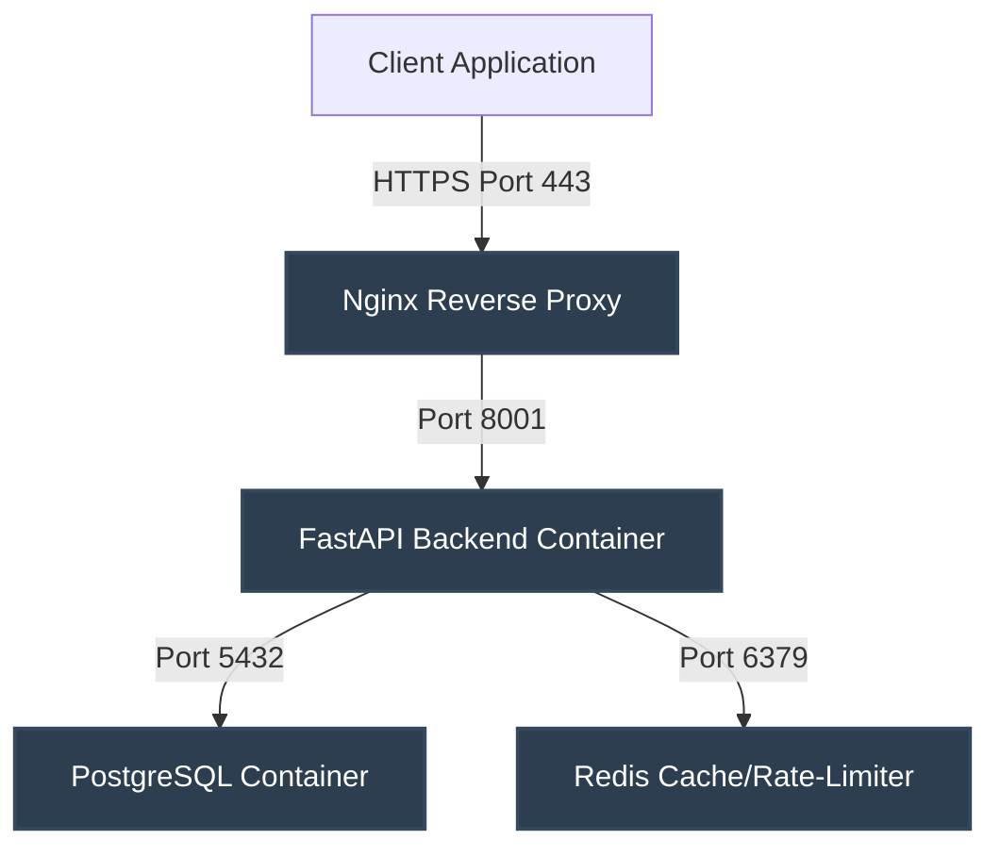

# Production Deployment Plan

This document details the production deployment architecture, Docker configurations, and containerization strategy for the Voice Flutter system.

---

## 1. Container Architecture

We will implement a multi-container architecture managed via Docker Compose:



---

## 2. Dockerfile for Backend (`backend/Dockerfile`)

Since the backend requires `ffmpeg` for Whisper transcriptions and `libreoffice` for high-quality document conversions, the base image must configure these system utilities:

```dockerfile
# Use a stable official slim Python base
FROM python:3.11-slim

# Prevent Python from writing .pyc files and enable unbuffered logging
ENV PYTHONDONTWRITEBYTECODE=1
ENV PYTHONUNBUFFERED=1

# Install system dependencies (ffmpeg, libreoffice, curl for health checks)
RUN apt-get update && apt-get install -y --no-install-recommends \
    ffmpeg \
    libreoffice \
    curl \
    build-essential \
    && apt-get clean \
    && rm -rf /var/lib/apt/lists/*

WORKDIR /workspace

# Install Python requirements
COPY requirements.txt /workspace/
RUN pip install --no-cache-dir -r requirements.txt

# Copy application source code
COPY app/ /workspace/app/

EXPOSE 8001

# Run uvicorn server
CMD ["uvicorn", "app.main:app", "--host", "0.0.0.0", "--port", "8001"]
```

---

## 3. Docker Compose Configuration (`docker-compose.yml`)

The compose orchestrates the backend container, PostgreSQL database, and Redis cache:

```yaml
version: '3.8'

services:
  backend:
    build:
      context: ./backend
      dockerfile: Dockerfile
    container_name: voice_backend
    restart: always
    ports:
      - "8001:8001"
    environment:
      - DATABASE_URL=postgresql://voice_user:voice_pass@db:5432/voice_db
      - REDIS_URL=redis://redis:6379/0
      - GEMINI_API_KEY=${GEMINI_API_KEY}
      - OPENAI_API_KEY=${OPENAI_API_KEY}
      - MISTRAL_API_KEY=${MISTRAL_API_KEY}
      - JWT_SECRET=${JWT_SECRET}
    volumes:
      - conversions_data:/D:/conversions
      - uploads_data:/workspace/uploads
      - logs_data:/workspace/logs
    depends_on:
      db:
        condition: service_healthy
      redis:
        condition: service_healthy
    healthcheck:
      test: ["CMD", "curl", "-f", "http://localhost:8001/"]
      interval: 30s
      timeout: 10s
      retries: 3

  db:
    image: postgres:15-alpine
    container_name: voice_postgres
    restart: always
    environment:
      - POSTGRES_USER=voice_user
      - POSTGRES_PASSWORD=voice_pass
      - POSTGRES_DB=voice_db
    ports:
      - "5432:5432"
    volumes:
      - postgres_data:/var/lib/postgresql/data
    healthcheck:
      test: ["CMD-SHELL", "pg_isready -U voice_user -d voice_db"]
      interval: 10s
      timeout: 5s
      retries: 5

  redis:
    image: redis:7-alpine
    container_name: voice_redis
    restart: always
    ports:
      - "6379:6379"
    volumes:
      - redis_data:/data
    healthcheck:
      test: ["CMD", "redis-cli", "ping"]
      interval: 10s
      timeout: 5s
      retries: 5

volumes:
  postgres_data:
  redis_data:
  conversions_data:
  uploads_data:
  logs_data:
```

---

## 4. Environment Separation

We will use two Compose profile configurations to handle environments:

### Development (`.env.dev`)
- API hot-reload enabled (`--reload`).
- Exposed databases port configurations for direct debugging access.
- Local mocked credentials.

### Production (`.env.prod`)
- Multi-worker Uvicorn configurations (`--workers 4`).
- Isolated backend network (PostgreSQL/Redis ports are not bound to public host).
- Mounted external volume directories for backup cron jobs.

---

## 5. Logging Configuration

Configure Docker daemon JSON logging limits in `/etc/docker/daemon.json` or compose file to avoid disk filling issues:

```yaml
logging:
  driver: "json-file"
  options:
    max-size: "50m"
    max-file: "5"
```

---

## 6. Backup Strategy

To ensure zero-data-loss for lead registrations, SQLite authentication records, and generated documents:

1. **Automated Database Backups**:
   - A cron script (`scripts/backup_db.sh`) runs nightly on the host:
     ```bash
     docker exec -t voice_postgres pg_dump -U voice_user voice_db | gzip > /backups/postgres_db_$(date +%F).sql.gz
     ```
2. **Backup Retention**:
   - Keep daily backups for 7 days, weekly backups for 4 weeks, and monthly backups for 1 year.
3. **Recovery Verification**:
   - Monthly testing restoring backup snapshots into a development docker container to verify backup validation.
